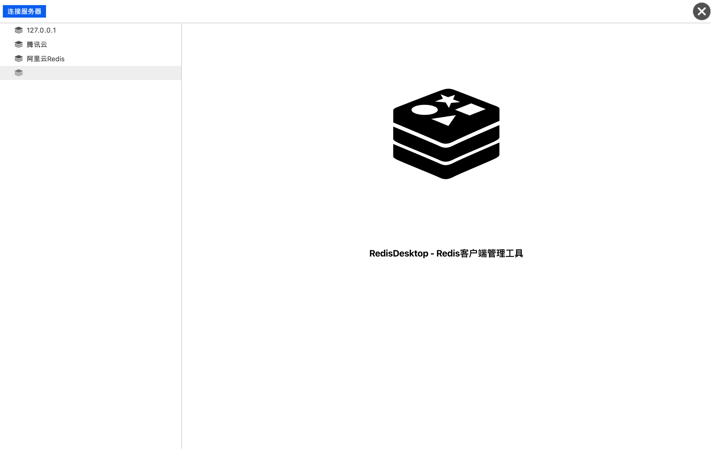
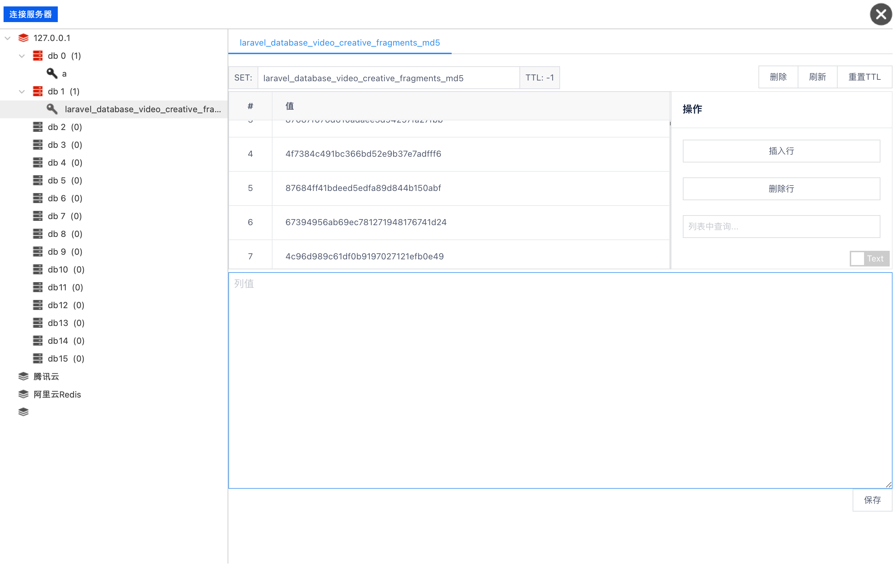

# GOQT-REDIS
`GOQT-REDIS` 是一个基于GO语言、QT(engine + webview)、QML、Vue开发的跨平台Redis管理工具。

# 特性
- 支持常见的数据结构的CRUD、TTL管理、服务器信息显示、慢日志查询. 
- 还原`redis-cli`客户端(不依赖本地安装redis服务)并且还原大部分响应结果。
- 复杂命令建议从原生CLI处理。 
- 支持发布订阅模式。

# 截图
- 管理界面

- 内容管理

